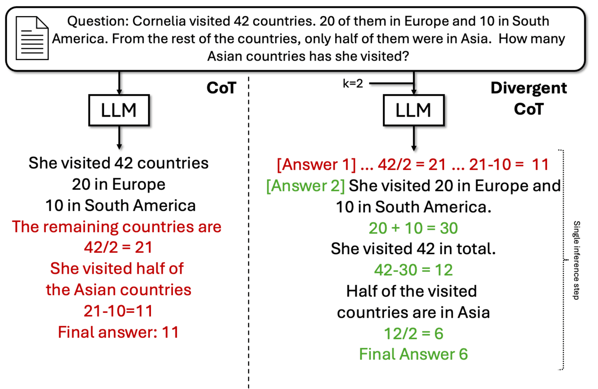

# Fine-Tuning with Divergent Chains of Thought Boosts Reasoning Through Self-Correction in Language Models

This repository includes the code and prompts to fine-tune and evaluate LLMs on Divergent Chain of Thought as described in our 2024 arXiv paper "Fine-Tuning with Divergent Chains of Thought Boosts Reasoning Through Self-Correction in Language Models."


> **Abstract**:
We present a novel method of further improving performance by requiring models to compare multiple reasoning chains before generating a solution in a single inference step. We call this method Divergent CoT (DCoT).
We generate a DCoT dataset where a question is answered by a series of alternative (and correct) chains of thought. Importantly, all these CoTs are part of the same label, thus, forcing the LLM to learn how to generate multiple CoTs in a single inference step.
We find that instruction tuning on DCoT datasets boosts the performance of LLMs of all sizes (from 1.3B to 70B). These performance gains stem from models generating multiple divergent reasoning chains in a single inference step, indicative of the enabling of self-correction in language models.




## Running the Models
We provide the best checkpoints for our DCoT models on Hugging Face. You can run them simply with the following code (or **run Demo.ipynb**):

```
from peft import LoraConfig, PeftModel
from transformers import AutoModelForCausalLM, AutoTokenizer
import torch

# select the model you want to run
base_model_path = "meta-llama/Llama-2-7b-hf"
peft_model_id = "haritzpuerto/LLaMA2-7B-dcot"

# load the model and tokenizer
model = AutoModelForCausalLM.from_pretrained(
            base_model_path,
            torch_dtype=torch.bfloat16,
            device_map="auto",
        )
# the model is loaded in fp16, feel free to use 8bit if needed
model.load_adapter(peft_model_id)

tokenizer = AutoTokenizer.from_pretrained(base_model_path)

# prompt the model
prompt = "[Question] Juan and LaKeisha roll a few objects down a ramp. They want to see which object rolls the farthest. What should they do so they can repeat their investigation?\n[Options] A) Put the objects in groups. B) Change the height of the ramp. C) Choose different objects to roll. D) Record the details of the investigation.\n[Number of answers] 2\n[Answer 1] "

inputs = tokenizer(prompt, return_tensors="pt")
output = model.generate(**inputs.to("cuda"), max_length=1024)
print(tokenizer.decode(output[0]))
```

### Prompt Template
```
[Question] {question} [Context] {document} [Options] {answer_options} [Number of answers] {k}
```
Note, that not all commands (text in brackets) are mandatory. `[Context]` and `[Options]` are optional. 
- `[Context]` refers to a paragraph that contains the answer to a question (for span-extraction QA).
- `[Options]` refers to a list of candidate answers (for multiple-choice QA). The format is `A) {answer option 1} B) {answer option 2}, ...`

The minimal template is

```
[Question] {question} [Number of answers] {k}
```

The inclusion of context and options depends on your taks.

> You can see the models in this Hugging Face collection: https://huggingface.co/collections/haritzpuerto/dcot-667ade6bb3c1b9aac8267b71

### Response format
You should expect the model returning the following type of text

```
[Answer 1]CoT_1
[Answer 2]CoT_2
...
[Final answer] answer
```

You should get as many answers as requested with the command `[Number of answers] {k}` 


## Reproducing the Experiments
This section will show you how to reproduce the experiments in our paper. In particular, how to train LLMs with our proposed DCoT and the CoT baseline, and how to evaluate the 

> The output data is available at https://tudatalib.ulb.tu-darmstadt.de/handle/tudatalib/4266

- This data includes prompts, model responses, post-processes responses, and results.

### Getting Started
1. Prepare a virtual environment:
```bash
conda create -n dcot python=3.10
conda activate dcot
pip install -r requirements.txt
```

2. Download the evaluation data
This will download the datasets we used for evaluation.

```bash
sh download_eval_data.sh
```


### Training
Running this script will train your LLM with LoRA on our DCoT intruction-tuning data as described in the paper.

```bash
$ python training_script.py \
    --train \
    --base_model_path YOUR_MODEL_PATH/models--llama-2-hf/7B \
    --lora_path YOUR_LORA_OUTPUT_PATH/ \
    --train_path data/dcot_collection/cot9_dataset.json \
    --epochs 3\
    --training_batch_size 4 \
    --dcot \
    --seed 0
```

To train the CoT baseline, you just need to change `--dcot` by `--cot`.


### Model Checkpoints
You can download the model checkpoints for CoT and DCoT in the following links:
- [Phi 1.5](https://tudatalib.ulb.tu-darmstadt.de/handle/tudatalib/4270)
- [Phi 2](https://tudatalib.ulb.tu-darmstadt.de/handle/tudatalib/4269)
- [LLaMA 7B](https://tudatalib.ulb.tu-darmstadt.de/handle/tudatalib/4268)
- [LLaMA 13B](https://tudatalib.ulb.tu-darmstadt.de/handle/tudatalib/4267)
- [LLaMA 13B-Chat](https://tudatalib.ulb.tu-darmstadt.de/handle/tudatalib/4272)
- [LLaMA 70B](https://tudatalib.ulb.tu-darmstadt.de/handle/tudatalib/4271)


### Evaluation
Running this script will evaluate your trained LLM with LoRA on the evalauation benchmark we used in our paper. The output will let you replicate Tables 2, 3, 4, and 6 in our paper.

```bash
$ python evaluation.py \
    --base_model_path YOUR_MODEL_PATH/models--llama-2-hf/7B \
    --lora_path YOUR_LORA_OUTPUT_PATH/ \
    --min_cots 1 \
    --max_cots 4 \
```

If you are running the CoT baseline, set `--max_cot 1` since you can only generate 1 cot.

To evaluate on Big Bench Hard and thus replicate Table 5, you need to run 

```bash
$ python bbh_evaluation.py \
    --base_model_path YOUR_MODEL_PATH/models--llama-2-hf/7B \
    --lora_path YOUR_LORA_OUTPUT_PATH/ \
    --min_cots 1 \
    --max_cots 4 \
```

If you are running the CoT baseline, set `--max_cot 1` since you can only generate 1 cot.

#### Remarks on Phi 1.5 and 2
vLLM is not compatible with Phi 1.5 and Phi 2 with lora. Therefore, to evaluate with lora you need to merge the lora weights on the base model first. To do this, we provide `merge_weights.py`. You can run the evaluation as follows

```bash
$ python merge_weights.py \
    --base_model_path YOUR_MODEL_PATH \
    --lora_path YOUR_LORA_PATH \
```

Running this scirpt will generate a folder `merged_model` in YOUR_LORA_PATH. Then, you can run the evaluation on the merged model.

```bash
$ python evaluation.py \
    --base_model_path YOUR_PATH_TO_PHI_MERGED_MODEL \
    --postprocess_responses \
    --min_cots 1 \
    --max_cots 4 \
```


## Output Inspection
You can see some output samples manually analyzed in `dcot_samples.json`


## Cite

If you find our work useful, please consider citing it using the following citation:

```
@misc{puerto2024dcot,
      title={Fine-Tuning with Divergent Chains of Thought Boosts Reasoning Through Self-Correction in Language Models}, 
      author={Haritz Puerto and Tilek Chubakov and Xiaodan Zhu and Harish Tayyar Madabushi and Iryna Gurevych},
      year={2024},
      eprint={2407.03181},
      archivePrefix={arXiv},
      primaryClass={cs.CL},
      url={https://arxiv.org/abs/2407.03181}, 
}
```

## Disclaimer

> This repository contains experimental software and is published for the sole purpose of giving additional background details on the respective publication. 

✉️ Contact person: Haritz Puerto, haritz.puerto@tu-darmstadt.de

https://www.ukp.tu-darmstadt.de/

https://www.tu-darmstadt.de/

Don't hesitate to send us an e-mail or report an issue if something is broken (and it shouldn't be) or if you have further questions.
